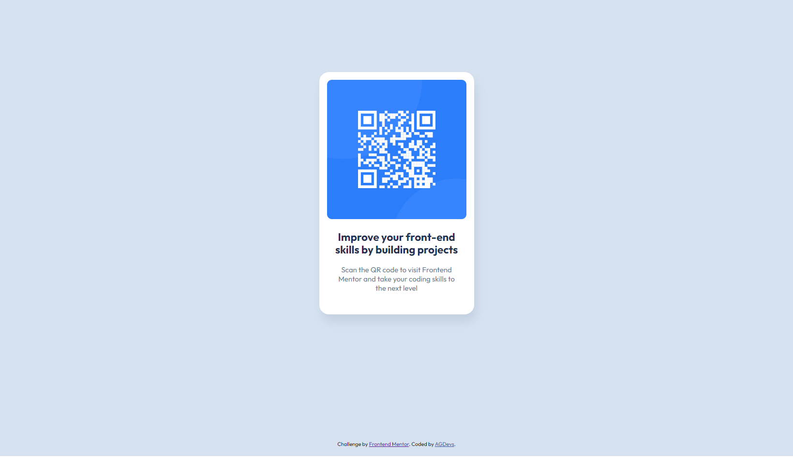

# Frontend Mentor - QR code component solution

This is a solution to the [QR code component challenge on Frontend Mentor](https://www.frontendmentor.io/challenges/qr-code-component-iux_sIO_H). 

## Table of contents

- [Overview](#overview)
  - [Screenshot](#screenshot)
  - [Links](#links)
- [My process](#my-process)
  - [Built with](#built-with)
- [Author](#author)

## Overview

### Screenshot

### Links

- Solution URL: [Repository](https://github.com/8NeoN8/frontEndMasters-qr-component)
- Live Site URL: [Github Page]([https://your-live-site-url.com](https://8neon8.github.io/frontEndMasters-qr-component/))

## My process

### Built with

- Semantic HTML5 markup
- CSS custom properties
- Flexbox
- Mobile-first workflow

## Author

- Github - [Andres Gonzalez | AGDevs](https://github.com/8NeoN8)
- Frontend Mentor - [Andres Gonzalez | AGDevs](https://www.frontendmentor.io/profile/8NeoN8)
